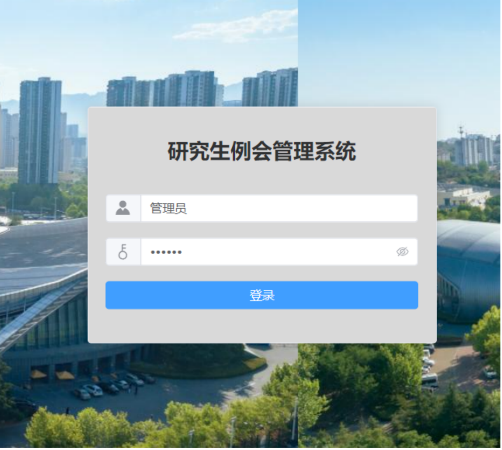
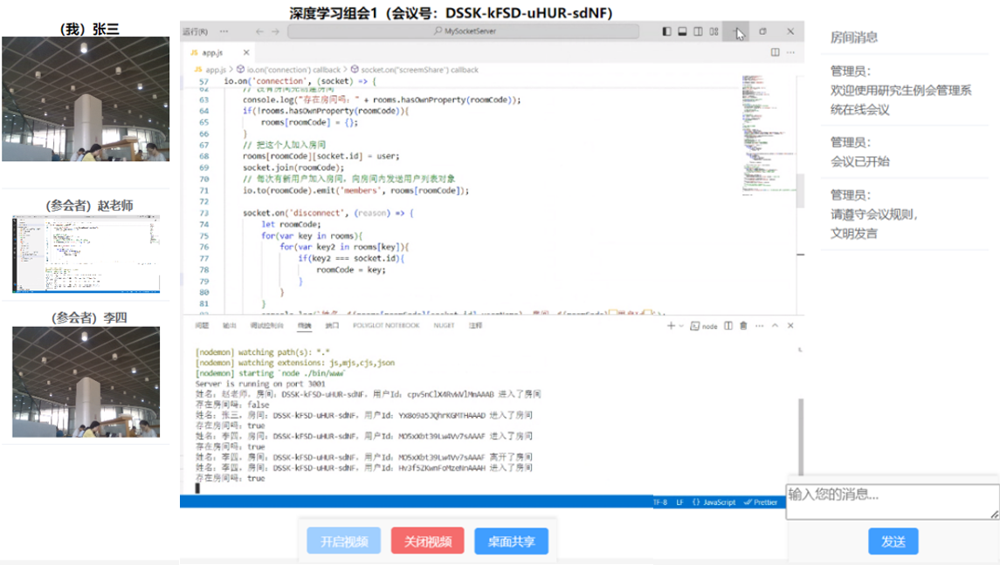
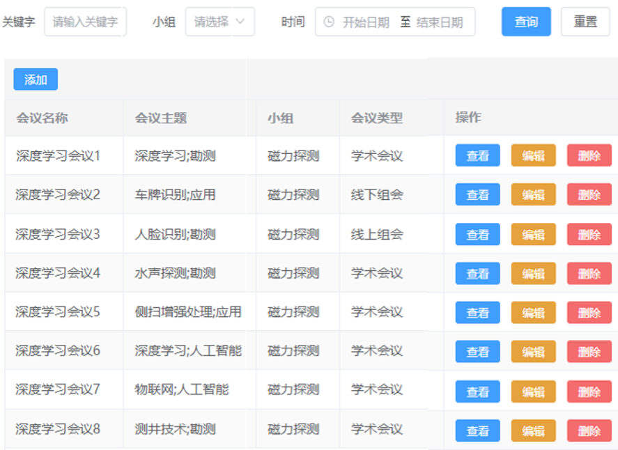
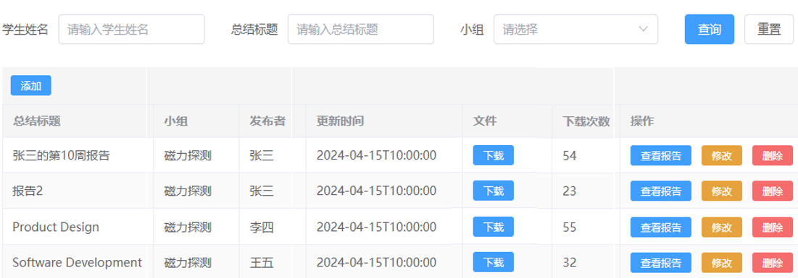
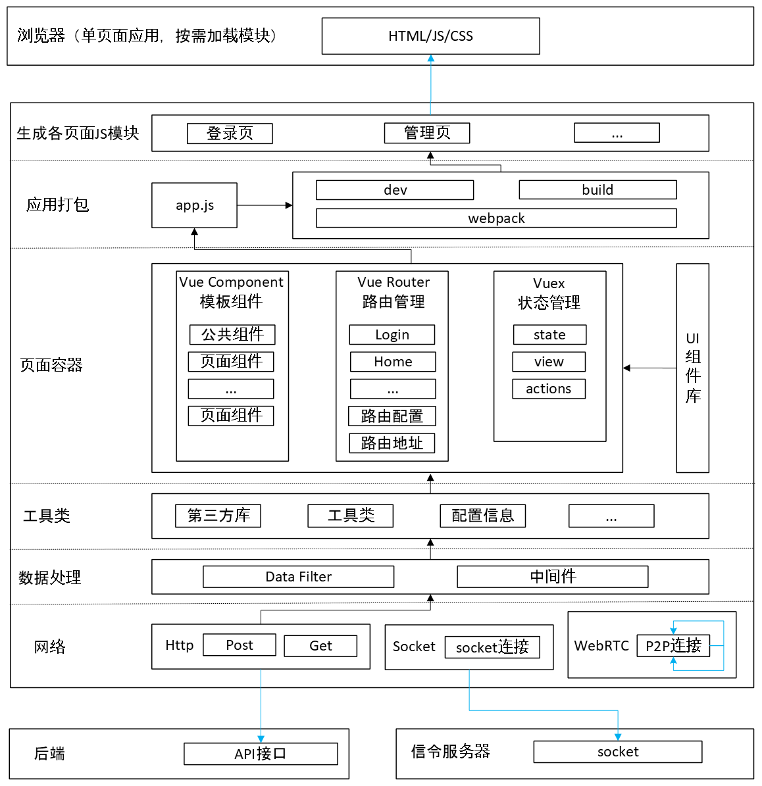
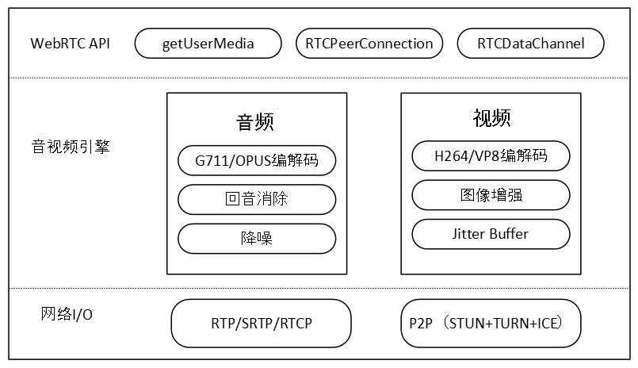
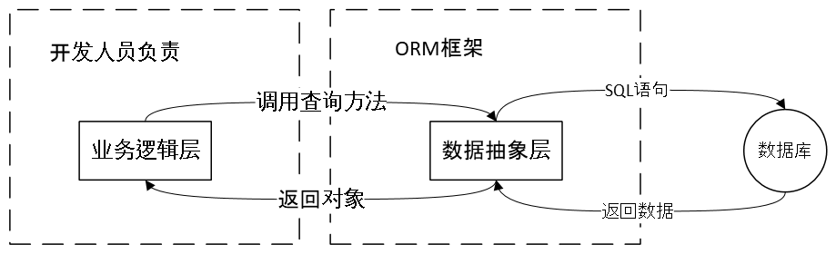
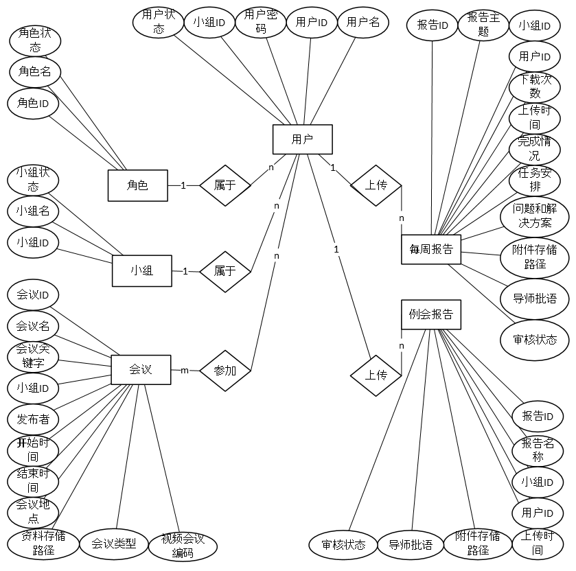

# <p align="center">OpenMeeting

<p align="center">会议管理 · 视频会议 · 基于 WebRTC

- **frontend** — Vue 3 + Element Plus + Socket.IO 信令服务器
- **backend** — ASP.NET Core + PostgreSQL + Redis
- **infra** — Docker Compose 部署

## <p align="center">快速开始

### 方式一：Docker 一键启动

> 只需要 [Docker](https://www.docker.com/)

```bash
# 准备环境配置
cp infra/.env.example infra/.env

# 一键启动所有服务
cd infra && docker-compose up -d
```

### 方式二：本地开发

> 环境要求：
> - [Docker](https://www.docker.com/) — 运行 PostgreSQL、Redis 等基础设施
> - [.NET SDK 10.0](https://dotnet.microsoft.com/download) — 后端开发与运行
> - [Node.js](https://nodejs.org/) ≥ 16 — 前端开发与运行（含 npm）

```bash
# 1. 准备环境配置
cp infra/.env.example infra/.env
cp frontend/.env.local.example frontend/.env.local

# 2. 启动基础设施（PostgreSQL、Redis、pgAdmin）
cd infra && docker-compose up -d

# 3. 启动后端（首次运行会自动还原依赖、执行迁移和种子数据）
cd backend && dotnet run --project MeetingSystem.WEB

# 4. 启动前端（同时启动 Socket.IO 信令服务器）
cd frontend && npm install && npm run serve
```

### 本地访问

- 前端：http://localhost:8086
- Socket.IO 信令服务器：http://localhost:3001
- 后端：http://localhost:5000（Docker）/ http://localhost:7099（本地开发）
- PostgreSQL：localhost:5432
- Redis：localhost:6379
- pgAdmin（数据库可视化管理）：http://localhost:5050 ，登录账密 `admin@admin.com` / `admin123`。添加服务器时 Host 填 `postgres`，其余连接信息同 `infra/.env`

## <p align="center"> 系统界面

### 1.师生登陆



### 2.视频会议



### 3.会议管理



### 4.报告管理



## <p align="center">结构

### 1.前端技术架构



### 2.WebRTC的组成部分



### 3.使用ORM框架



### 4.业务数据库E-R图




## <p align="center">致谢

- 后台管理模板：[vue3-element-admin](https://gitee.com/asaasa/vue3-element-admin)（by Asa）
- WebRTC 视频会议：[WebRTC视频会议系统源码](https://www.bilibili.com/video/BV1GN411f7L2)（B站 UP 主：顶级云加）
